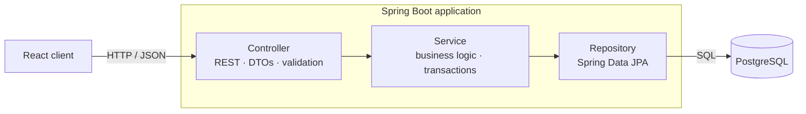

# VeloCity Fleet API

*The backend for VeloCity — an e-bike rental platform.*

## Overview

Renting an e-bike sounds like simple CRUD — until two customers try to book the **same bike for overlapping dates at the same moment**. A naive "check if it's free, then save" loses that race: both requests see the bike as available, both succeed, and now one bike is double-booked. Making that impossible — cleanly and at scale — is the problem this project is built around.

VeloCity Fleet API is the backend service behind the VeloCity rental app (React frontend). It handles the full journey: browsing available bikes, registering an account, reserving a specific bike for a date range, pricing the rental, and moving it through its lifecycle (pending → confirmed → completed/cancelled).

**Who uses it**

- **Clients** browse available bikes, book them for chosen dates, and manage their own reservations.
- **Admins** manage the physical fleet (active, maintenance, retired) and oversee users.

## Tech Stack

Every tool here earns its place - picked for a specific job.

| Technology | Why it's here |
|---|---|
| **Java 25 & Spring Boot 4** | The dominant backend stack in Polish enterprise, fintech, and banking. |
| **PostgreSQL** | Keeps booking and financial data consistent — and enforces the no-double-booking guarantee at the database level. |
| **Hibernate / JPA** | Maps the domain model to tables without hand-writing SQL for everyday access. |
| **Liquibase** | Every schema change is versioned and repeatable, the way real teams manage databases. |
| **Spring Security + JWT** | Stateless authentication and role-based access (client vs admin). |
| **BigDecimal** | Exact money arithmetic — no floating-point rounding on prices. |
| **JUnit 5 & Mockito** | Automated tests, including proof that double-booking is blocked. |
| **Docker & Docker Compose** | One-command local database and a containerized, deploy-anywhere app. |
| **GitHub Actions** | Continuous integration — every change is built and tested automatically. |
| **Swagger / OpenAPI** | Interactive, always-current API docs to easily navigate through the app. |

## Architecture

A standard three-layer Spring Boot service: each request flows from the controller down to the database, with each layer owning one job.



**The layers**

- **Controller** — speaks HTTP: maps requests to DTOs, validates input, returns consistent `ProblemDetail` errors. No business logic.
- **Service** — the brain: business rules, orchestration, and transaction boundaries.
- **Repository** — data access via Spring Data JPA. The database owns schema and integrity, including the constraint that makes double-booking impossible.

Entities guard their own rules (a reservation validates its own status transitions), a deliberate rich-domain choice recorded in the ADRs.

## Getting Started

To run the API locally, you need Docker (to spin up the database) and Java 25.

**Start the database:**

```bash
docker-compose up -d
```

**Run the application:**

```bash
./mvnw spring-boot:run
```

**Explore the API:**

Navigate to the interactive Swagger UI at: `http://localhost:8080/swagger-ui.html`

### Core Endpoints

| Method | Endpoint | Description | Access |
|---|---|---|---|
| `GET` | `/api/v1/bikes` | List available e-bikes for a date range | Public |
| `POST` | `/api/v1/reservations` | Book a bike for specific dates | Client |
| `PATCH` | `/api/v1/reservations/{id}/status` | Transition reservation state (e.g., Cancel) | Client / Admin |
| `POST` | `/api/v1/auth/register` | Create a new user account | Public |
| `POST` | `/api/v1/auth/login` | Authenticate and receive JWT | Public |

## Status & Roadmap

This project is under active development.

**Currently Built:**

- Rich Domain Model for reservations (strict state machine transitions).
- Pricing calculation logic.
- Global RFC 7807 exception handling and strict JPA transaction boundaries.
- Liquibase database migrations and `ddl-auto: validate` setup.

**Coming Next:**

- The core concurrency hook: PostgreSQL range types and exclusion constraints to physically block double-bookings at the disk level.
- Spring Security implementation with JWT access control.
- Admin-facing fleet management endpoints.
