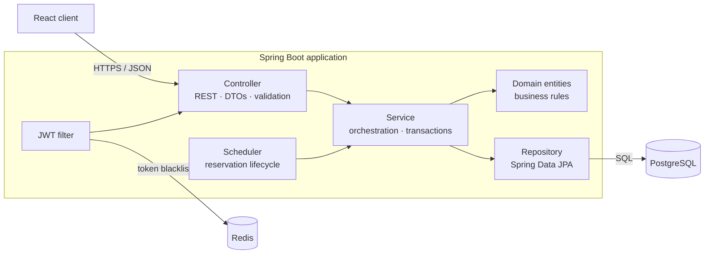

# VeloCity Fleet API

[](https://github.com/jakub-jurkian/velocity-api/actions/workflows/ci.yml)
[](https://github.com/jakub-jurkian/velocity-api/actions/workflows/deploy.yml)

*The backend for an e-bike rental platform.*

| | |
|---|---|
| **Live app** | [www.velocityfleet.dev](https://www.velocityfleet.dev) |
| **Live API docs** | [api.velocityfleet.dev/api/swagger-ui.html](https://api.velocityfleet.dev/api/swagger-ui.html) |
| **Guided demo** | [DEMO.md](DEMO.md) - demo accounts and a step-by-step tour with expected results |
| **Frontend repo** | [jakub-jurkian/velocity-client](https://github.com/jakub-jurkian/velocity-client) (React, Vite, Redux Toolkit) |

> The live demo uses publicly listed demo accounts, including an admin one. Please do not register
> with real personal data.

## Overview

The project is built around one problem: two customers trying to book the same bike for overlapping dates at the same moment.
A naive "check if it's free, then save" fails here - both requests see the bike as available, both succeed, and one bike ends up double-booked.

**Who uses it**

- **Clients** browse available bikes in their city, book them for chosen dates, and manage their own reservations.
- **Admins** manage the physical fleet (active, maintenance, lost, retired), oversee users, and read revenue and occupancy analytics.

## Tech Stack

| Technology | Why it's here |
|---|---|
| **Java 25 & Spring Boot 4** | This stack offers stability & strictness for developing backend solutions. |
| **PostgreSQL** | Keeps booking and financial data consistent - and enforces the no-double-booking guarantee at the database level. |
| **Hibernate / JPA** | Maps the domain model to tables without hand-writing SQL for everyday access. |
| **Liquibase** | Every schema change is versioned and repeatable, the way real teams manage databases. |
| **Spring Security + JWT** | Stateless authentication and role-based access (client vs admin). |
| **Redis** | Token revocation: logging out blacklists the token's ID until it would have expired anyway. |
| **Spring Scheduling** | Background jobs that expire unconfirmed bookings and complete finished rentals. |
| **BigDecimal** | Exact money arithmetic - no floating-point rounding on prices. |
| **JUnit 5, Mockito & Testcontainers** | Unit tests for the domain, plus integration tests against a real PostgreSQL and Redis - including proof that double-booking is blocked. |
| **Docker & Docker Compose** | One-command local Postgres and Redis; the production image and stack. |
| **GitHub Actions** | CI runs the test suite on every push and PR; CD builds the image and deploys it. |
| **Oracle Cloud VM + Caddy** | Hosts the production stack; Caddy terminates HTTPS in front of the API. |
| **Swagger / OpenAPI** | Interactive API docs to easily navigate through the app. |

## Architecture

A modular monolith with a standard three-layer structure: each request flows from the controller down to the database, with each layer owning one job.


```mermaid
flowchart LR
    Client["React client"] -->|HTTPS / JSON| Controller
    subgraph API["Spring Boot application"]
        Filter["JWT filter"]
        Controller["Controller<br/>REST · DTOs · validation"]
        Service["Service<br/>orchestration · transactions"]
        Domain["Domain entities<br/>business rules"]
        Repository["Repository<br/>Spring Data JPA"]
        Scheduler["Scheduler<br/>reservation lifecycle"]
        Filter --> Controller --> Service --> Domain
        Service --> Repository
        Scheduler --> Service
    end
    Filter -->|token blacklist| Redis[("Redis")]
    Repository -->|SQL| DB[("PostgreSQL")]
```

**The layers**

- **Controller** - speaks HTTP: maps requests to DTOs, validates input, returns consistent `ProblemDetail` errors. No business logic.
- **Service** - orchestration: loads entities, calls their behaviour, owns transaction boundaries.
- **Domain** - entities guard their own rules (a reservation validates its own status transitions, a retired bike refuses to come back), a deliberate rich-domain choice recorded in the ADRs.
- **Repository** - data access via Spring Data JPA. The database owns schema and integrity, including the constraint that makes double-booking impossible.

Code is organised by feature (`reservation`, `bike`, `user`, `auth`, `pricing`, `analytics`, `security`), not by technical layer.

## Engineering Decisions
- **Double-booking is prevented by the database, not by a service check.** A PostgreSQL exclusion constraint over `(bike_instance_id, daterange(start_date, end_date))` rejects any overlapping active reservation, however many requests race. The service still checks availability first, but only to return a friendly error. See [ADR-001](docs/adrs/0001-prevent-reservation-race-conditions.md) and `ReservationConcurrencyIntegrationTest`.
- **Rich domain model.** Entities are created through factory methods, have no public setters, and enforce their own invariants and state machines. See [ADR-002](docs/adrs/0002-adopt-rich-domain-model-architecture.md).
- **Optimistic locking for admin edits.** Bike status changes carry the `version` the admin last saw; a stale edit returns `409` instead of silently overwriting someone else's change.
- **Taking a bike off the road is guarded.** If the bike has current or upcoming rentals, the API returns `409` with the list of affected reservations. Repeating the call with `?force=true` cancels them with a recorded reason.
- **One error format.** Every error is an RFC 9457 `application/problem+json` response; validation failures add a per-field `invalidFields` map.
- **Server-side pricing.** Quotes are computed on the server with `BigDecimal` and stored with the reservation, so a later price change never alters an existing booking.
- **Accounts are checked on every request.** The JWT only identifies the caller; role and blocked status are re-read from the database, so blocking a user takes effect immediately.
- **Time is injected.** Every "today" comes from a `Clock` bean (Europe/Warsaw), which keeps date rules testable and independent of the server's timezone.

## Trade-offs and Known Limitations

- **Token revocation fails open.** If Redis is unreachable, the blacklist check is skipped so the API stays available; a logged-out token could then be accepted until Redis returns. Logout itself fails loudly rather than pretending it worked.
- **24-hour access tokens, no refresh tokens.** Simple for a demo; a production system would use short-lived access tokens with refresh tokens.
- **One extra query per request.** Reloading the user on every request buys instant blocking and role changes.
- **The public demo resets itself.** Demo data is re-seeded on every start and all reservations are rebuilt, so anything a visitor books is temporary. See [DEMO.md](DEMO.md).

## Running Locally

Requires Docker and Java 25.

```bash
docker compose up -d        # PostgreSQL + Redis
./mvnw spring-boot:run      # API on http://localhost:8080 (dev profile)
./mvnw test                 # full suite; Testcontainers starts its own databases
```

To run locally with the same demo data as the live site, see [DEMO.md](DEMO.md#option-b--locally-with-the-same-demo-data).

## Architecture Decision Records

- [ADR-001 - Prevent e-bike double-booking under concurrency](docs/adrs/0001-prevent-reservation-race-conditions.md)
- [ADR-002 - Adopt a rich domain model](docs/adrs/0002-adopt-rich-domain-model-architecture.md)
- [ADR-003 - Project context file for AI-assisted development](docs/adrs/0003-adopt-project-context-file-with-ai-assistant-grounding.md)
